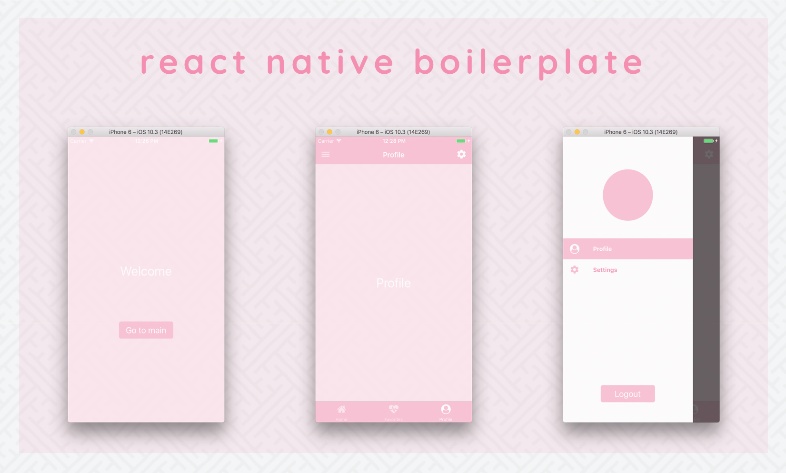

# React Native Boilerplate

[](https://david-dm.org/bkdev98/react-native-boilerplate/status.svg)
[](https://david-dm.org/bkdev98/react-native-boilerplate?type=dev)
[](#badge)
[](https://github.com/EQuimper/eslint-config-equimper)
[](http://makeapullrequest.com)

> A React Native boilerplate with Expo, Redux, React Navigation, Styled Components and some 💕 included.



## Demo

- Run with Expo: [React Native Boilerplate](https://expo.io/@bkdev/react-native-boilerplate)

## Technologies
- [React Native (Expo)](https://docs.expo.io/versions/v18.0.0/index.html)
- [React Navigation](https://reactnavigation.org/)
- [Redux](redux.js.org)
- [Styled Components](https://www.styled-components.com/)
- [ESLint](https://github.com/eslint/eslint) & [Prettier](https://github.com/prettier/prettier)

## Getting Started
Clone this repository
```
$ git clone git@github.com:bkdev98/react-native-boilerplate.git new-project
```
Install node modules, [Yarn](https://yarnpkg.com/en/) is highly recommended.
```
$ yarn
```
Open and start project using [Expo XDE](https://expo.io/tools) or use the [CLI](https://github.com/expo/exp) :
```
$ exp start
```
Run on Android/iOS device or simulator
```
$ exp ios
$ exp android
```
Open project in any [code](https://code.visualstudio.com/) editors and have fun 🍻

## Contribution
All PRs are welcome 💕

## Contact
- [Facebook](https://facebook.com/bkdev98)
- [Twitter](https://twitter.com/bkdev98)
